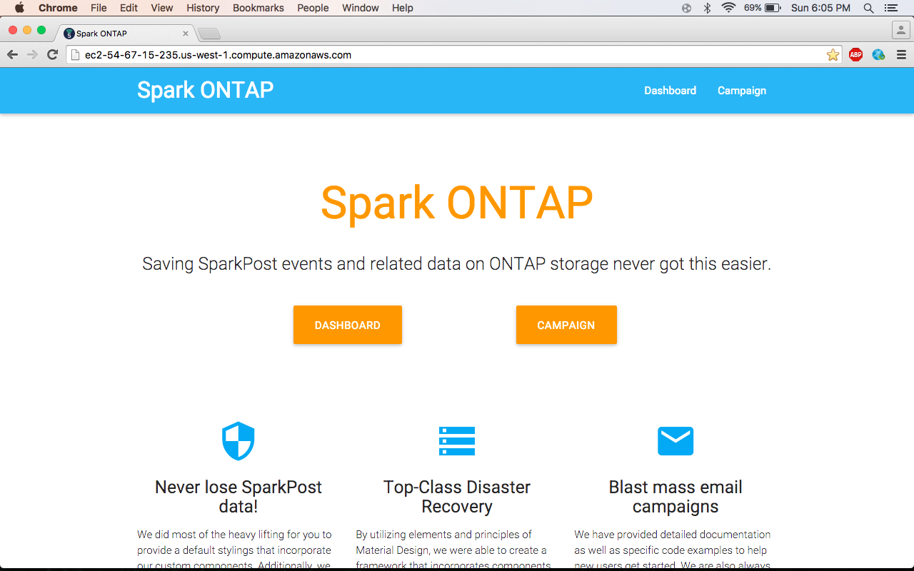
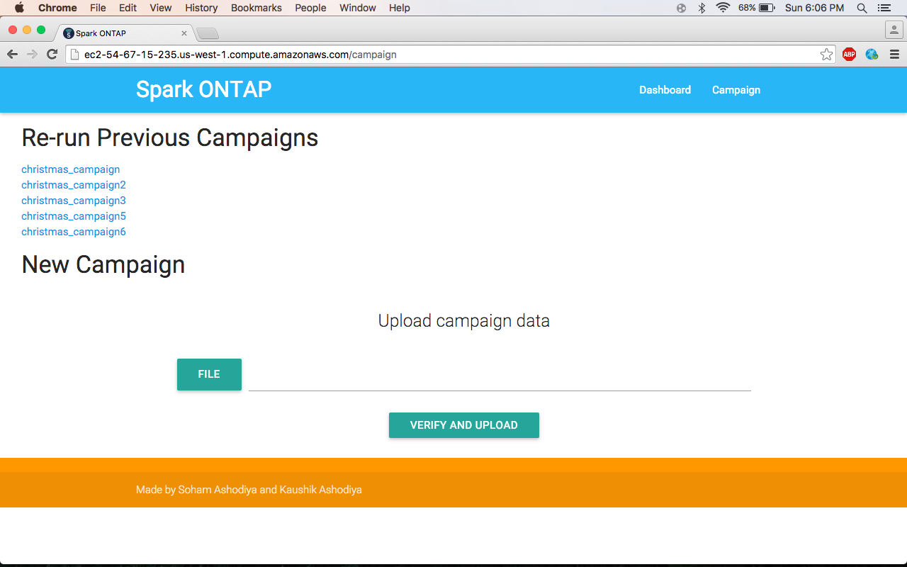
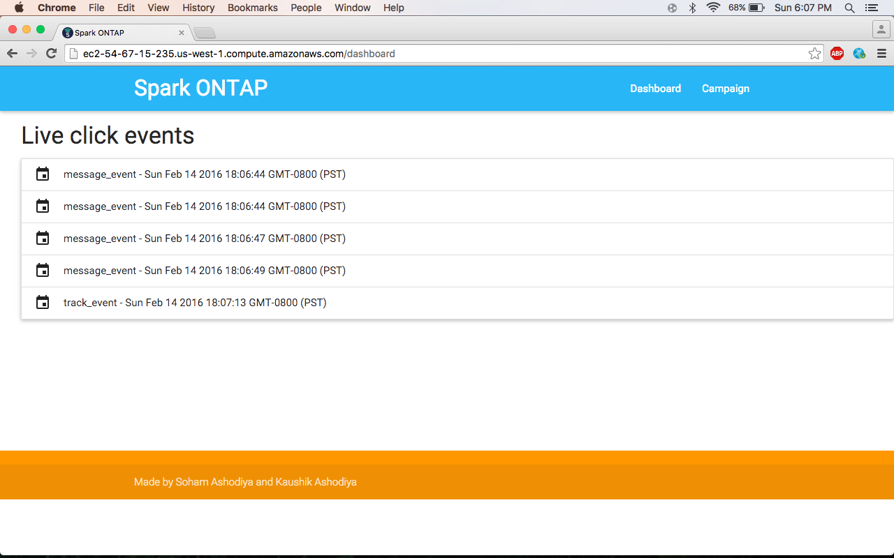
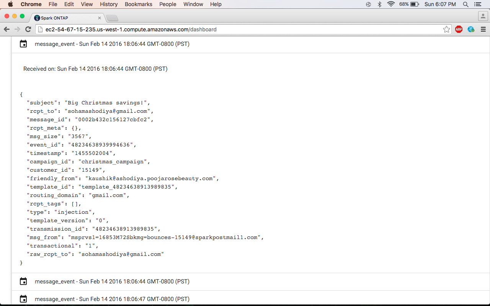

# Spark ONTAP

Saving SparkPost events and related data on ONTAP storage never got this easier.

## What exactly does it provide?

* Top-Class Disaster Recovery
    * Achieves top-class disaster recovery by integrating Netapp’s ONTAP.
    * We are using ONTAP’s disaster recovery facility.
    * The data is replicated to a disaster recovery server.
    * If the primary server goes down, the secondary server can be used to read data.

* Blast mass email campaigns
    * Send hundreds of emails just by ONE click.
    * The product has the capability to rerun campaigns.
    * One can also rerun previous campaigns.
    * Monitor your campaign in realtime!

* Keep all your SparkPost data with you!
    * SparkPost only keeps your data for only 10 days.
    * Our product saves ALL the Webhook data.
    * Webhook data contains: emails sent, emails opened, and clicked link data.
    * All the email campaigns are stored securely.
    * All the data can be optionally encrypted.
    * The data is available for doing data analytics using BigData and other technologies. 

## Built With

* Node.js + Handlebars 
* SparkPost
* Netapp's ONTAP
* Socket.io

## Video Demonstration

## Screenshots

### Home Page

### Creating new campaign.

### Verify the contents of the email and other crucial information.

### When the receivers click on the email, live click events will appear.

### Upon clicking of each event, the campaign manager can see more information on the event.
