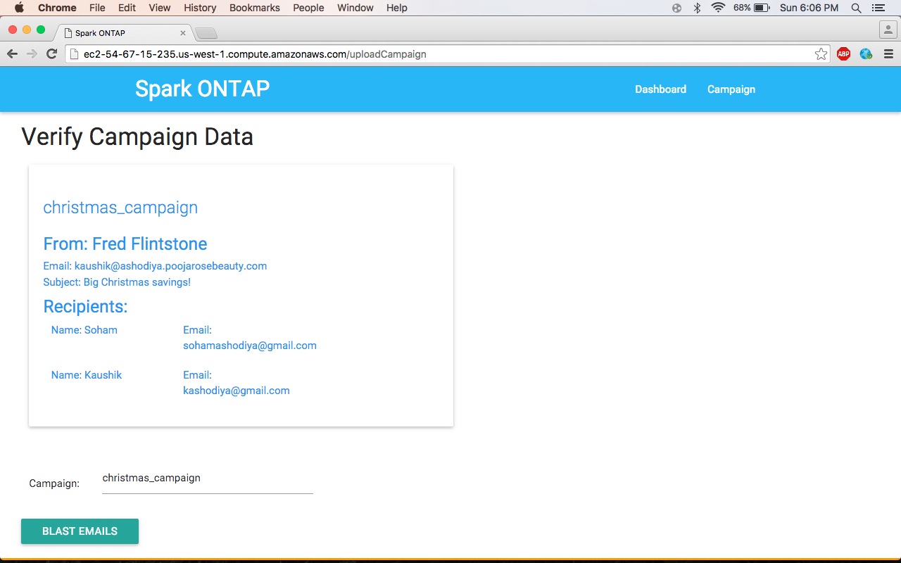

## Winner project of 2016 DevloperWeek hackathon 

### For more information read presentation <a href="info/Spark ONTAP.pdf">slides</a>.

##Technologies Used:
- Node.js
- Express
- SparkPost
- Socket.io
- Handlebars
- Materialize

###Home Page

###Creating new campaign.

###Verify the contents of the email and other crucial information.

###When the receivers click on the email, live click events will appear.

###Upon clicking of each event, the campaign manager can see more information on the event.

##Demo

